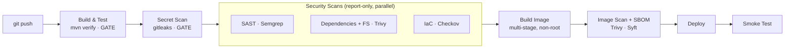

<div align="center">

# Advanced CI/CD — A DevSecOps Pipeline

**Security woven through the delivery pipeline: every commit is built, tested, and scanned across five dimensions — code, secrets, dependencies, infrastructure, and the container image — before it ships, with an SBOM generated for every build.**

[](.github/workflows/devsecops.yml)
[](https://trivy.dev/)
[](https://semgrep.dev/)
[](https://www.checkov.io/)
[](https://www.docker.com/)

</div>

---

## The Problem

A normal CI pipeline proves code *compiles and passes tests*. It says nothing
about whether a secret was committed, a dependency has a known CVE, the
infrastructure is misconfigured, or the shipped container is full of
vulnerabilities. Those gaps are exactly where real incidents come from.

This project closes them. It extends a standard build-and-ship pipeline into a
**DevSecOps** pipeline: automated security checks at every stage, failing fast on
the things that should never ship and reporting on the rest — so security is part
of delivery, not an afterthought.

## The Pipeline



| Stage | Tool | What it catches | Posture |
|-------|------|-----------------|---------|
| Build & Test | Maven + JUnit | broken code, failing tests | **gate** |
| Secret Scan | gitleaks | committed credentials | **gate** |
| SAST | Semgrep | insecure code patterns | report |
| Dependencies + FS | Trivy | vulnerable libraries, misconfig | report |
| Infrastructure as Code | Checkov | insecure Terraform | report |
| Image Scan | Trivy | CVEs in the built image | report |
| SBOM | Syft | software bill of materials (SPDX) | artifact |

**Gates** block the build (broken code and leaked secrets must never ship).
**Report** scans publish findings as build artifacts for triage — the thresholds
can be tightened to hard failures as the project matures. The structure is
already in place.

## Key Engineering Decisions

| Decision | Why it was made |
|----------|-----------------|
| **Secret scanning is a hard gate** | A leaked key is the one finding that is never acceptable — it stops the pipeline outright. |
| **Early scans report, later gates block** | Blocking every build on an unpatched transitive CVE stalls delivery; surfacing it for triage keeps security visible *and* the pipeline moving — a realistic DevSecOps posture. |
| **Multi-stage, non-root container** | Build tooling is discarded from the final image, and the app runs as `appuser` (uid 1001) so a container compromise doesn't start as root — both are things image scanners check for. |
| **Secure-by-default coding** | The `/echo` endpoint HTML-escapes untrusted input (unit-tested), demonstrating the secure practices the pipeline is meant to enforce. |
| **Hardened Terraform to scan** | `infra/` ships an S3 bucket with encryption, versioning, and public-access blocked — real IaC for Checkov to validate. |
| **SBOM on every build** | A Syft SPDX bill of materials makes "what's actually in this image" answerable for supply-chain and audit needs. |
| **Self-contained scanner steps** | Scanners run as pinned CLIs/containers, so the pipeline is reproducible and not hostage to third-party action changes. |

## Verified

- `mvn clean verify` — JAR built, **4 unit tests pass** (including the XSS-escaping tests).
- Endpoints confirmed locally: `/`, `/health`, and `/echo` (escapes `<script>` payloads).
- The image was run and confirmed to serve traffic **as a non-root user** (`uid=1001 appuser`).
- The full scanning pipeline runs in GitHub Actions on every push; a Jenkins equivalent is in [`Jenkinsfile`](Jenkinsfile).

## Technology Stack

| Area | Technologies |
|------|--------------|
| Build & test | Java 21, Maven, JUnit 5 |
| Pipelines | GitHub Actions, Jenkins (declarative) |
| Security scanning | gitleaks (secrets), Semgrep (SAST), Trivy (deps + image), Checkov (IaC) |
| Supply chain | Syft (SBOM, SPDX) |
| Packaging | Docker (multi-stage, non-root), Terraform (scanned) |

## Repository Structure

```text
.
├── pom.xml                      # Maven build (runnable JAR) + JUnit
├── src/                         # HtmlEscaper (secure encoding) + App + tests
├── Dockerfile                   # multi-stage, non-root, health-checked
├── infra/main.tf                # hardened Terraform (scanned, not applied)
├── Jenkinsfile                  # Jenkins DevSecOps pipeline
├── .github/workflows/           # GitHub Actions DevSecOps pipeline
├── architecture/                # pipeline diagram
└── docs/                        # implementation notes
```

## Getting Started

```bash
# Build and test locally
mvn clean verify

# Run it
docker build -t devsecops-app .
docker run -p 8080:8080 devsecops-app
curl http://localhost:8080/health          # -> OK
```

The security scans run automatically in CI on every push; see
[`.github/workflows/devsecops.yml`](.github/workflows/devsecops.yml) and the
[implementation notes](docs/implementation-notes.md).

## What This Demonstrates

- **DevSecOps** — shifting security left with automated gates and scans across the whole pipeline.
- **The full scanning toolbox** — SAST, secret detection, dependency/image CVE scanning, IaC scanning, and SBOM generation.
- **Container & application hardening** — multi-stage builds, non-root runtime, secure output encoding.
- **Pipeline engineering** — gates vs. report-only stages, parallelism, artifacts, and the same pipeline expressed in both GitHub Actions and Jenkins.
